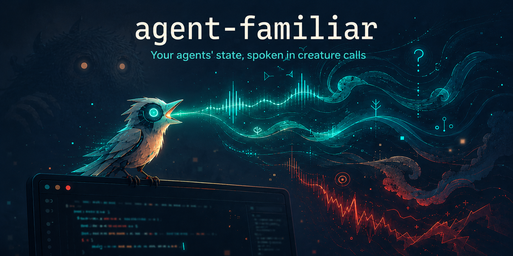

A triumphant whoop means tests went green. A low growl means something broke — the deeper the growl, the bigger the trouble. Insistent croaks mean the session is blocked waiting on you. After awhile, you stop translating and just *know*.

A hook reads the tail of the session transcript, runs it through local embeddings, and plays a short organic creature call (or musical motif) that tells you what the session needs and how it's going — without looking at the screen.

## Demo (WITH SOUND -- UNMUTE!)

🔊 **Unmute for the creature calls** — they're the whole point.

https://github.com/user-attachments/assets/7fd0afa9-cff4-417f-b995-82db0f226e6e

## Requirements

- macOS or Linux
- Python 3.10+ (stdlib only — no pip installs)
- [sox](https://sox.sourceforge.net/) for synthesis
- An audio player: `afplay` (built into macOS) or `paplay`/`aplay`/`ffplay` (Linux)
- [ollama](https://ollama.com) running locally, for embeddings (optional — falls back to a cruder lexicon analysis without it)
- [Claude Code](https://claude.com/claude-code), for the hook (the CLI works with any text)

## Installation

```bash
# prerequisites
brew install sox ollama            # macOS
# sudo apt install sox && curl -fsSL https://ollama.com/install.sh | sh   # Debian/Ubuntu

brew services start ollama         # macOS (Linux: ollama serve)
ollama pull all-minilm             # 46MB embedding model

# agent-familiar
git clone https://github.com/rickgorman/agent-familiar ~/work/agent-familiar
cd ~/work/agent-familiar
./install.sh
```

`install.sh` verifies every prerequisite, builds the anchor tables, and smoke-tests synthesis. It tells you exactly what's missing and how to get it.

<details>
<summary>Manual installation (what install.sh does)</summary>

```bash
sox --version                                    # synthesis
python3 --version                                # 3.10+
curl -s localhost:11434/api/tags | grep all-minilm && echo embeddings OK

cd ~/work/agent-familiar
python3 build_anchors.py   # embeds affect axes + texture bank (~1s, needs ollama up)
python3 build_bank.py      # optional: note bank for the legacy --engine bank fallback
```

</details>

### Hear it

```bash
echo "all tests pass, shipped to production" | python3 familiar.py play --mode creature
```

A happy whoop-chirp within ~300ms. If not:

| symptom | fix |
|---|---|
| silence, no error | check output device + volume; try `FAMILIAR_VOLUME=1.0` |
| `sox: command not found` | install sox (see above) |
| silence on Linux | install a player: `pulseaudio-utils`, `alsa-utils`, or `ffmpeg` |
| `phrase` output shows `"source": "bow"` | ollama not serving — start it, then `./install.sh` again |

### Wire into Claude Code

Symlink so the hook has a stable path, then merge the hook entries into `~/.claude/settings.json` (create the file with `{"hooks": {...}}` if it doesn't exist; if you already have `Stop`/`Notification` hooks, append to their arrays):

```bash
ln -s ~/work/agent-familiar ~/.claude/agent-familiar
```

```json
"Notification": [
  { "matcher": "", "hooks": [
    { "type": "command", "command": "~/.claude/agent-familiar/hook.sh" }
  ]}
],
"Stop": [
  { "matcher": "", "hooks": [
    { "type": "command", "command": "~/.claude/agent-familiar/hook.sh" }
  ]}
]
```

`Stop` infers the call from the transcript tail. `Notification` always plays the blocked-waiting-on-you croak. Hooks are snapshotted at session launch — **restart Claude Code sessions to pick this up**.

## The Vocabulary

| you hear | it means | need |
|---|---|---|
| descending coo-coo | task finished, settled | nothing |
| whoop + rising chirps | big win | come enjoy it |
| rising chirps ("mrrp?") | question waiting — more chirps = more thought required | answer when ready |
| insistent croak-barks + hanging chirp | session blocked on you | come now |
| low growl (+snarls) | something broke — lower = bigger stakes | look |
| tiny peep | status blip, work continues | ignore freely |
| fading hoots | heading into long background work | check back later |
| purring | doing the same thing repeatedly | maybe unstick it |

Inflection carries the rest: pitch wobble = the session is uncertain; body size = stakes; speed/brightness = urgency; a whole-tone strangeness = unfamiliar territory for this session; rising/falling grace notes = things trending better/worse.

## Modes

| mode | sound | when to use |
|---|---|---|
| `creature` | one animal: coos, growls, chirps, croaks | the default — ambient and legible |
| `duet` | two animals: the session vs. its adversary — victory, confrontation, retreat, petition, standoff | when you want to hear *who's winning* |
| `vocab` | musical motifs on synth pads, same vocabulary | calmer, more musical rooms |
| `pad` / `full` | single-pad tones / genre grooves (trance, boom-bap, dnb...) | earlier experiments, kept for fun |

Try them:

```bash
echo "FATAL: production is down" | python3 familiar.py play --mode duet
echo "FATAL: production is down" | python3 familiar.py play --mode vocab
```

## Configuration

All knobs are environment variables:

| variable | default | meaning |
|---|---|---|
| `FAMILIAR_MODE` | `creature` | hook's mode: `creature` \| `duet` \| `vocab` |
| `FAMILIAR_VOLUME` | `0.35` | playback volume, 0.0–1.0 |
| `FAMILIAR_EMBEDDER` | `ollama` | `ollama` \| `http` \| `hashing` |
| `FAMILIAR_OLLAMA_URL` | `http://localhost:11434/api/embeddings` | ollama endpoint |
| `FAMILIAR_OLLAMA_MODEL` | `all-minilm` | embedding model |
| `FAMILIAR_HTTP_URL` | — | your own embedding endpoint (`http` backend) |
| `FAMILIAR_EMBED_TIMEOUT` | `0.6` | seconds before falling back to lexicon analysis |
| `FAMILIAR_DIR` | `~/.claude/agent-familiar` | where hook.sh finds the install |

Set them inline in the hook command to configure per-hook:

```json
{ "type": "command", "command": "FAMILIAR_MODE=duet FAMILIAR_VOLUME=0.5 ~/.claude/agent-familiar/hook.sh" }
```

## CLI reference

```
echo TEXT | python3 familiar.py COMMAND [flags]

commands:
  play      analyze, synthesize, and play
  render    same, but write a wav (--out path.wav)
  phrase    print the full analysis + composed events as JSON (no audio)

flags:
  --mode    vocab | creature | duet | pad | full
  --need    force the need word: done | triumph | question | halted |
            alert | status | departure   (default: inferred)
  --session ID   trajectory key — drift/trend/loop detection per session
  --text    TEXT inline instead of stdin
```

The `--session` flag is what gives the familiar memory: repeated similar states trigger the *going-in-circles* purr, sudden changes trigger movement ornaments, and improving/worsening trends add rising/falling grace notes.

## How it works

1. `hook.sh` receives the hook event, tails the last ~1000 chars of the transcript
2. `embedder.py` embeds it locally (~20ms warm)
3. `familiar.py` projects the embedding onto affect axes (valence, arousal, certainty, progress), texture directions (locality: similar moods sound similar), and the session's own trajectory (drift, trend, loops — stored in `state.json`)
4. A call is composed — need word + inflection — synthesized through `sox` patches (`synth.py`), mixed in pure-stdlib Python, and played
5. Total latency ~250-300ms, fire-and-forget

```
familiar.py       analysis + composers (vocab/creature/duet) + CLI
synth.py          sox synthesis patches + voice cache
embedder.py       pluggable embeddings (ollama / http / hashing)
anchors.json      affect-axis pole exemplars (edit to retune the axes)
build_anchors.py  bakes anchors.json -> anchors.embedded.json
build_bank.py     optional note bank for the legacy bank engine
hook.sh           Claude Code adapter
install.sh        prereq checks + build + smoke test
```

Generated at runtime (gitignored): `anchors.embedded.json`, `voices/` (cached synthesized voices — safe to delete anytime), `state.json` (session trajectories), `notes/`.

## Future Ideas

- **More agents** - The core is agent-agnostic (`text in, sound out`); adapters for other agent CLIs are ~20 lines each. Per-agent *species* — your Claude a songbird, your CI a crow — would make a room of agents legible by ear.

- **Formant vowels** - Chain bandpass resonances to give calls vowel-like vocal tract color.

- **Rate limiting** - Suppress status peeps when they'd fire more than once a minute; silence is part of the vocabulary.

- **Anchor growth** - Log embeddings that land far from the affect axes and mine them for new axis poles; the vocabulary adapts to your actual work.

- **Duet hook** - `Stop` plays the solo creature, but big dominance swings (victory, retreat) could summon the second creature.

- **Resident daemon** - A warm process would cut the ~250ms to sub-100ms and enable layered, evolving calls.

## License

MIT
